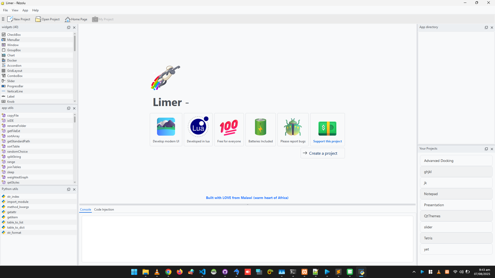

## ⚠️ IMPORTANT INSTRUCTIONS

Limekit is a framework developed in Python 3.10 that wraps around the PySide6 (Qt) framework. Please download and install python 3.10+ first.
⚠️ Visit https://www.python.org/downloads/ before proceeding

⚠️ But, you don't need to learn python AT ALL!! Only lua

⚠️⚠️ At the moment, I do not have a Mac, so, I can not guide you on how to install or run on it ⚠️⚠️

## Where to Download

Navigate to the Release section (to your right) and download the all the files in there (Limer-Limekit.rar, Tools.rar) to get started

## How to install
There are 3 compressed files to download and use.

1. Tools.rar
   - You shall use install.bat or install.sh to install the limekit-xx-py3-none-anyany.whl file
   - INSTALL THIS FIRST
     
2. For Limer, simply extract contents from Limer-Limekit.rar
   - The "run" files only help in debugging (showing errors on the console), feel free to use the run.py too. 

## Running Apps

You'll use the app called Limer mentioned above to create and run all Limekit programs and all Limekit examples provided.

## DONE?

You shall be greeted with this beautiful screen

